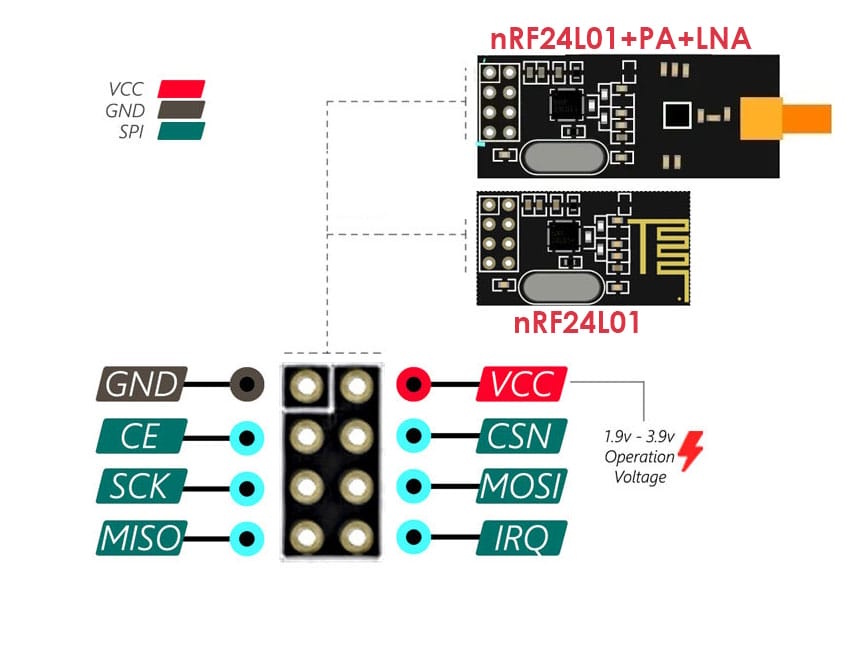
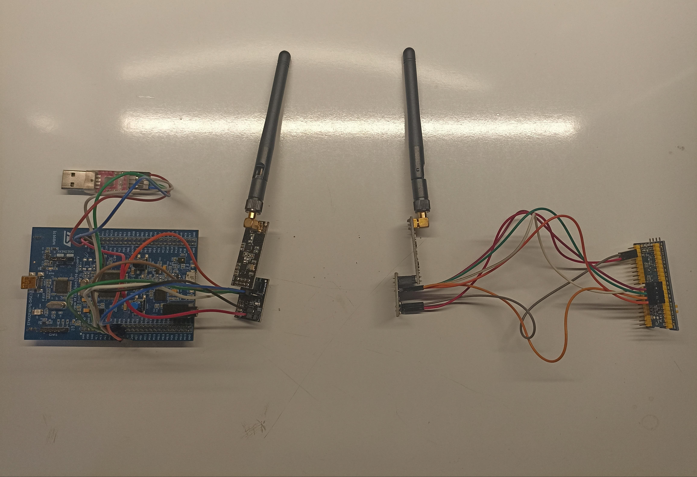

# STM32 NRF24L01 Wireless Communication

This project demonstrates wireless data communication between two STM32 microcontrollers using the **NRF24L01+ PA/LNA** module. The project uses a **custom NRF24L01 driver** written in C and supports 32-byte payloads, basic transmit and receive functions, and easy integration with STM32 HAL.

---

## Introduction Project

<div style="text-align: center;">
  
</div>
These are the modules that are generally.<br><br>

<div style="text-align: center;">
  
</div>
This adapter provides a clean Jul 3.3V supply for our module. You need to feed it with 5V.<br><br>

<div style="text-align: center;">
  
</div>
The view of the circuit I made myself.<br><br>

---

## 📁 Project Structure

```
STM32_NRF24L01_.../
├── NRF24L01/
│   ├── Inc/
│   │   └── NRF24L01.h          # Header file for driver
│   └── Src/
│       └── NRF24L01.c          # Source file for driver
```

---

## 📡 Features

- 🧠 Lightweight, clean NRF24L01 driver with STM32 HAL
- 📡 SPI communication support
- 📦 Supports full 32-byte payload size
- 🚀 Easily configurable for both transmit and receive mode
- ⚙️ CE and CS pin abstraction for flexible GPIO setup

---

## 🛠️ Requirements

- **MCU**: STM32F103 or STM32F407VG
- **Wireless Module**: NRF24L01+ (PA/LNA supported)
- **Interface**: SPI1 (or configurable)
- **Power**: 3.3V regulated (⚠️ *do not use 5V!*)
- **Other**:
  - GPIO pins for `CE` and `CSN`
  - UART for debug (optional)
>NOTE: If you want to use 5V, you should buy it from the extra sold adapter

---

## ⚙️ Pin Configuration Example

In your `main.c`, define GPIOs used for CE and CSN:

```c
NRF24L01 nrf;
nrf.hspi = &hspi1;
nrf.CE.PORT = GPIOA;
nrf.CE.PIN = GPIO_PIN_3;
nrf.CS.PORT = GPIOA;
nrf.CS.PIN = GPIO_PIN_4;
```

---

## 🚀 Transmitter Example

```c
uint8_t tx_address[5] = {0xEE, 0xDD, 0xCC, 0xBB, 0xAA};
uint8_t payload[32] = "Hello from Transmitter!";

nrf24_init(&nrf);
nrf24_TxMode(&nrf, tx_address, 10); // Channel 10

while (1) {
    nrf24_Transmit(&nrf, payload);
    HAL_Delay(1000);
}
```

---

## 📡 Receiver Example

```c
uint8_t rx_address[5] = {0xEE, 0xDD, 0xCC, 0xBB, 0xAA};
uint8_t received_data[32];

nrf24_init(&nrf);
nrf24_RxMode(&nrf, rx_address, 10);

while (1) {
    if (nrf24_IsDataAvailable(&nrf, 1)) {
        nrf24_Receive(&nrf, received_data);
        printf("Received: %s\r\n", received_data);
    }
}
```
>Note: The USART library was used for debugging

---

## 🧠 Functions Provided

| Function | Description |
|----------|-------------|
| `nrf24_init()` | Initializes the module and resets registers |
| `nrf24_TxMode()` | Sets module to transmit mode |
| `nrf24_Transmit()` | Sends a 32-byte payload |
| `nrf24_RxMode()` | Sets module to receive mode |
| `nrf24_IsDataAvailable()` | Checks if data is ready to read |
| `nrf24_Receive()` | Reads received payload |

---

## 📌 Notes

- **The SPI Baud Rate speeds should be the same on both sides. (For example, 4.5Mbps)**
- **The SPI Baud Rate should be less than 8Mbps.**

---
## 📎 Documentation

You can download the NRF24L01 datasheet as PDF:

[⬇️ Download Datasheet (PDF)](https://github.com/SERENGOKYILDIZ/STM32_NRF24L01/raw/main/docs/nRF24L01P_PS_v1.0.pdf)

---

## 🧾 License

MIT License. You are free to use, modify, and distribute this project.

---

Made with ❤️ by **Semi Eren Gökyıldız**
